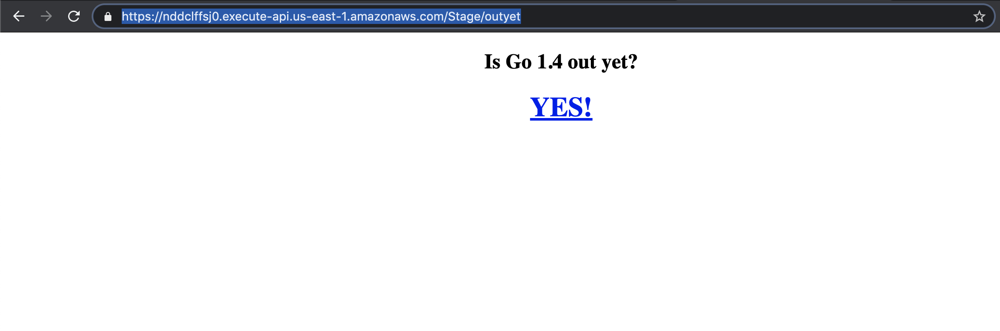

# Serverless Outyet Application

The application pings https://go.googlesource.com/go/+/go1.4 to check if Golang 1.4 has been released and renders the proper HTML template if the Head request returns a 200 response code.

This repo contains source code from the outyet golang.
https://github.com/golang/example/tree/master/outyet

The code needed to be modified in order to run on AWS Lambda

The following changes were made:
- Added the github.com/apex/gateway package as a lambda friendly replacement for the net/http ListenAndServe function
- Added a waitgroup to the server struct to ensure that the polling go routine executed. This needed to be done as the go routine was not completed upon lambda execution. (Most likely beacuse the lambda fires up upon request) Did not notice significant latency upon addition of this wait group.

- I added a header to set the content type to html to make sure the client browser renders the Html properly (As oppose to application/json containing HTML).

*The changes are also annotated within the code*

## Pre-Req
There are a few pre-requisites for boot-strapping/deploying this serverless application

In a production environment we would have these pre-reqs installed on our continious integration server (EG: Jenkins)

Tools:
- golang: Used to build the binary using the go build command
- aws cli: Used to deploy cloud formation stacks and also upload the zipped binary to an S3 bucket

Infrastructure:
- We need to have an IAM user with programmatic access and permissions (role or policy) to create an S3 bucket and run cloud formation stacks
- We need to have an S3 bucket. In our AWS SAM template we are assuming there is a pre-existing S3 bucket called "serverless-iac"

With the proper permissions (IAM) we can use the CLI to create this bucket

```
aws s3api create-bucket --bucket serverless-iac --region us-east-1
```

## Instructions on creating the infrastructure

Once we have the S3 bucket in place. We can simply run the deploy script which will handle the whole deployment.

**Script Steps:**
1. Using the go build command it readies a binary. Thanks to go modules it will also download all the dependencies it needs

2. Lambda expects a zip file containing the go binary, so we zip the result of step 1

3. Using the aws cloudformation cli to interpret our AWS SAM template file to create a packaged-template. This is very similar to `terrafrom plan` with an out flag execept that the result is still in yaml format.

4. Now we leverage the created packaged-template and tell aws to create a stack based on it. This will create all the resources we need. (Explained below)

5. We clean up the working directory (delete the binary and the zip file)

The great news is that we can run this when we want to update our lambda, this will re-deploy the lambda to reflect the newest code. This should ideally be done with a github hook upon merge. We can plug this script in directly to a CI server and have it do all the work for us.

## Infrastructure details
 - Cloudformation Stack: This is just a reflection of our infrastructure, and we can view this in the AWS Console.
- Lambda: The cloudformation also creates a go lambda that runs our modified outyet code.
 - API Gateway: This gets created via the SAM template
 named `serverless-outyet-stack` it also created two API Stages called "Stage" and "Prod" by default. This could be changed via the template yaml file. The gateway is configured to consume the lambda function upon invoked. It only supports the HTTP GET method.

## Functional Testing
We can run the following command to find the newly create api gateway ID

```
aws apigateway get-rest-apis
```

With that we can navigate to the API gateway route in the browser to view the desired HTML

Example:
```
https://nddclffsj0.execute-api.us-east-1.amazonaws.com/Stage/outyet
```

Expected Output:



## Optional Tasks
**SSL**

Due to us using API-Gateway we get SSL/TLS automatically. The API gateway uses AWS certificates and AWS has abstracted all of this for us. Our API will not accept HTTP.

**Scale**

Just by using serverless we are already fairly scalable, due to the nature of AWS Lambda. API Gateway is also highly-available and scalable out-of-the-box.

The only things we should keep in mind are:
 - default concurrent requests limit (1,000)
 - default AWS Gateway throttle limit of 10k requests per second.

If we need to scale above this we need to get a bit more creative.
For example, we can use Route53 with an appropriate policy to split the traffic amongst two different Serverless Stacks.

**Security**

##### Principal of Least Privilege
We want to make sure that our CI server or local user running the deploy script has the least possible permissions to be able to deploy. We want to limit the permissions to find grained roles as oppose to using a user or role with God mode (Admin Mode).

##### Security of Dependencies
We want to make sure that our dependencies no not have any vulnerabilities. Luckily, our application is simple, and we do not need to worry about sensitive data, user input, etc. We can use static code analysis to identify security risks within our code / dependencies.

##### DDoS and Cost
Our serverless stack is vulnerable to DDoS attack. A bad actor can run a load test against our system to try to bring it down. Due to AWS high-availability of the managed services, the system won't go down, however the bad actor can force us to approach our service limits, causing real users not to be able to access the application. This will also raise our bill as we are charged per request.

## Additional Explanation
I used AWS Serverless Application Model(Cloudformation under the hood) as it is compatible with Cloudformation and is less verbose that CloudFormation or Terraform. Another reason I liked this choice was because unlike Terraform or the Serverless Framework, it did not introduce a new pre-requisite.

AWS Lambda can be plugged into an application load balancer but I figured it made more sense to use API Gateway as it has built-in validations and supports query parameters and headers.
